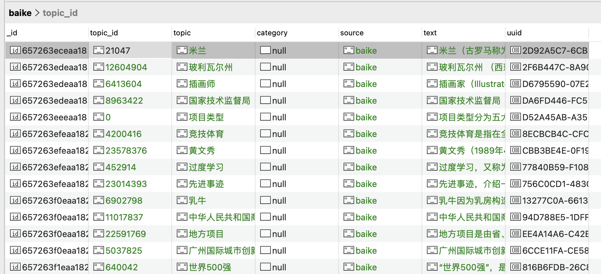

## Baike Spider


#### ①项目介绍 Introduction

百度百科爬虫，从一个百科词条链接为入口，爬取该词条的简介信息，然后进入该词条下的所有其他词条的链接，爬取其他词条的简介信息，依此循环，从而爬取整个百度百科所有的词条简介信息。

Baidu Baike crawler, from a wikipedia entry link as the entrance, crawl the brief information of the entry, and then enter the link of all other entries under the entry, crawl the brief information of other entries, and so on, so as to crawl the whole Baidu encyclopedia all the brief information of the entry.


#### ② 项目安装 Installation

进入项目根目录 Go to the project root directory

```shell
docker build . -t <name>:<tag>  
# eg:
docker build . -t baike:1.0
```


#### ③ 项目启动 Initiation

##### 1. 修改Settings.py中redis和mongodb配置

##### Modifying redis and mongodb configuration in Settings.py

```python
# 用于分布式部署和统计 For distributed deployment and statistics
REDIS_CONFIG = {
    'host': '43.139.62.67',
    'port': '6666',
    'db': '6',
    'password': 'chris'
}

# 用于存储爬取数据 For storing crawled data
MONGODB_CONFIG = {
    'host': '43.139.62.67',
    'port': '27000',
    'db': 'admin',
    'username': 'chris',
    'password': 'chris'
}
```


##### 2. 添加代理池

##### Adding a Proxy Pool

如果不挂代理池，爬几分钟就会被反爬，然后就拿不到数据了。这里以快代理的隧道代理池为例：

If you don't use the proxy pool, crawling for a few minutes will be counter-crawled, and then you can't get the data. Here is an example of tunneling proxy pools with fast proxies:

**middlewares.py中添加代理池中间件 Add agent pool middleware to middlewares.py**

```python

class ProxyDownloaderMiddleware:
    _proxy = ('h104.kdltps.com', '15818')

    def process_request(self, request, spider):
        # 用户名密码认证 User Name Password Authentication
        username = "t10191882634024"
        password = "y7jja6hs"
        request.meta['proxy'] = "http://%(user)s:%(pwd)s@%(proxy)s/" % {"user": username, "pwd": password,"proxy": ':'.join(ProxyDownloaderMiddleware._proxy)}
        # 白名单认证 whitelisting
        # request.meta['proxy'] = "http://%(proxy)s/" % {"proxy": proxy}
        request.headers["Connection"] = "close"
        return None

    def process_exception(self, request, exception, spider):
        """捕获407异常 Catching 407 exceptions"""
        if "'status': 407" in exception.__str__():  # 不同版本的exception的写法可能不一样，可以debug出当前版本的exception再修改条件 
          # Different versions of the exception may be written differently, you can debug the current version of the exception and then modify the condition
        from scrapy.resolver import dnscache
        dnscache.__delitem__(ProxyDownloaderMiddleware._proxy[0]) # 删除proxy host的dns缓存 Delete the proxy host's dns cache
        return exception

```

**Settings.py中开启代理池中间件 Enabling Agent Pool Middleware in Settings.py**

```python
DOWNLOADER_MIDDLEWARES = {
    "baike_spider.middlewares.RandomUserAgent": 43,
    'baike_spider.middlewares.ProxyDownloaderMiddleware': 100
}
```


##### 3. 启动爬虫脚本 Start the crawler script

```shell
# 以“金融”词条链接为例：https://baike.baidu.com/item/%E9%87%91%E8%9E%8D/860
# An example of a link to the word “finance”: https://baike.baidu.com/item/%E9%87%91%E8%9E%8D/860
docker run -idv /root/logs/baike:/root/logs/baike -e START_URL=https://baike.baidu.com/item/%E9%87%91%E8%9E%8D/860 baike:1.0 

# 如果启动不了 If it doesn't start.
docker ps -a # 查看所有容器，找到启动失败的容器ID Look at all containers and find the ID of the container that failed to launch
docker logs -f <容器ID>  # 查看日志，排查问题，是被反爬了导致没拿到数据而执行完毕了，还是其他什么原因 Check the logs to troubleshoot the problem, whether it was back-crawled and finished executing without getting the data, or something else
```


#### ④ 数据样例 Sample data

